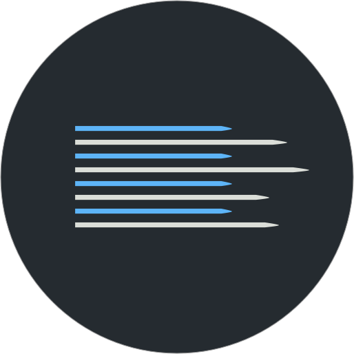
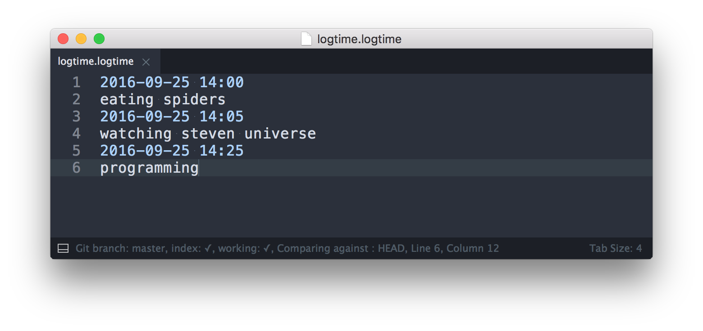
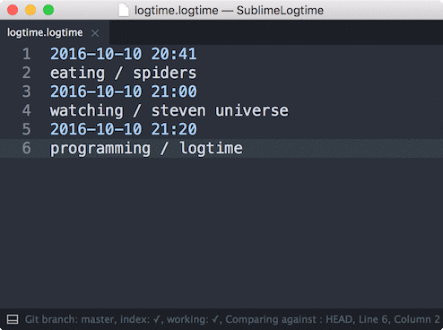

# Sublime Logtime

Sublime Text 3 plugin for time tracking, in plain text, using [logtime](https://github.com/bevesce/logtime).

 

## Installation

At least for now I don't want to unnecessarily pollute Package Control. So installation is manual:

```
git clone --recursive https://github.com/bevesce/SublimeLogtime.git Logtime
mv Logtime "path/to/Sublime Text 3/Packages/"
```

There's one git submodule here so you need to use `--recursive` flag.

## Features
### Syntax highlighting

Highlighting should work with every color scheme:



### Filter & sum

You can filter (by folding) log items with *logtime* queries:



Pressing enter will show quick panel with the total amount of time spent on resulting log items.


## License

Copyright 2016 Piotr Wilczyński. Licensed under the MIT License.
